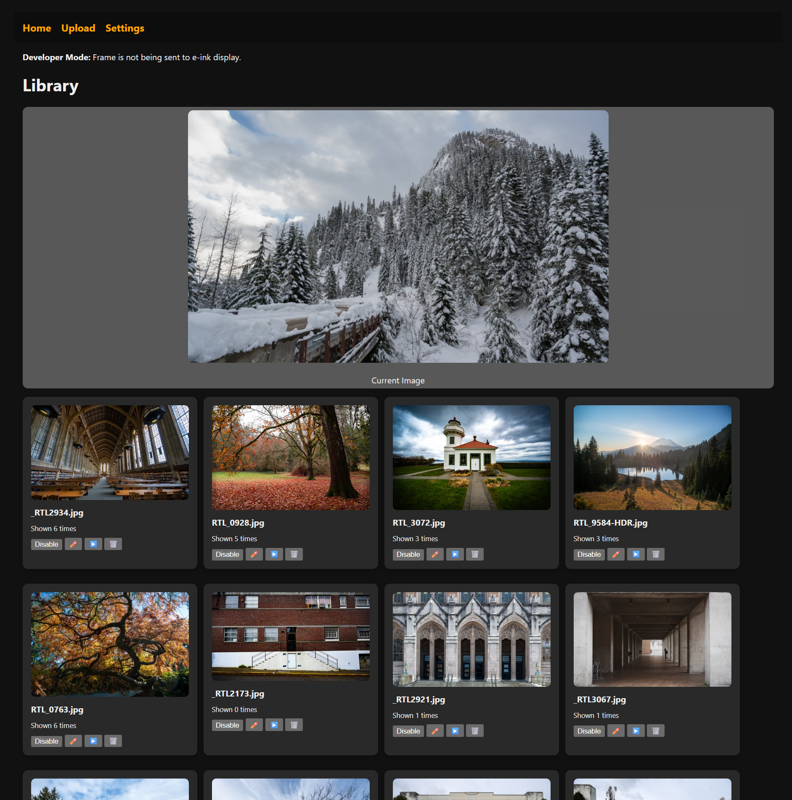
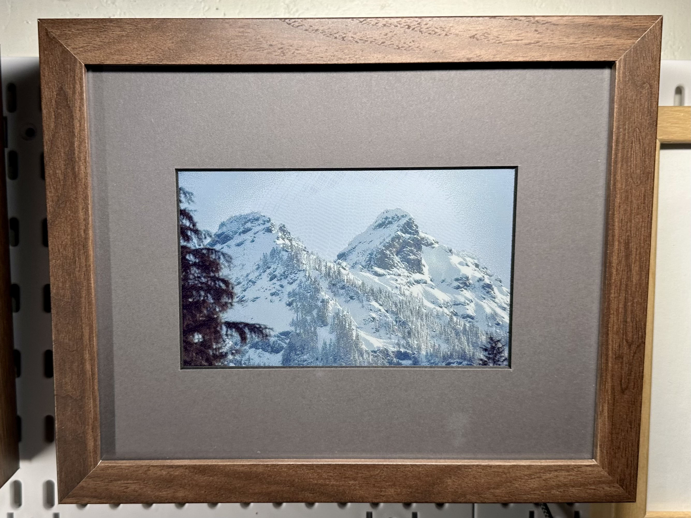
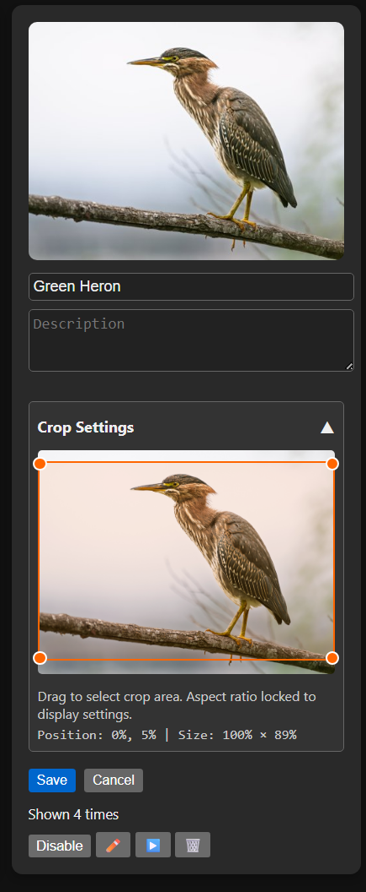
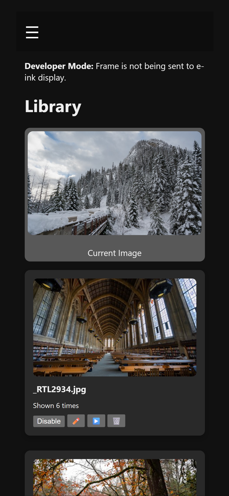

# E-Paper Image Frame

<!-- Add a hero image here when ready -->
<!--  -->

A web-based digital photo frame application designed for e-ink displays, featuring intelligent image cropping, slideshow functionality, and an intuitive web interface for managing your photo collection.

<!-- Add feature showcase images -->
## 📸 Screenshots


### Web Interface

*Main interface showing image gallery with edit controls*

### Mobile View

*Image displayed on Inky*

### Crop Editor
  
*Drag-and-drop crop tool with aspect ratio locking*

### Mobile View

*Responsive design works on all devices*


## 🖼️ Features

### Core Functionality
- **E-Ink Display Support**: Optimized for e-paper displays with proper image rendering
- **Web Interface**: Modern, responsive web UI for managing images remotely
- **Smart Cropping**: Visual crop editor with aspect ratio locking to display dimensions
- **Slideshow Mode**: Automatic image rotation with configurable timing
- **Multi-Image Upload**: Bulk upload support for efficient photo management

### Image Management
- **Drag & Drop Crop Tool**: Intuitive visual cropping with real-time preview
- **Metadata Editing**: Add titles and descriptions to your images
- **Image Controls**: Enable/disable, display instantly, or delete images
- **Usage Tracking**: See how many times each image has been displayed
- **Thumbnail Generation**: Automatic thumbnail creation for fast browsing

### Advanced Features
- **Developer Mode**: Test without physical e-ink display
- **Dual Rendering Modes**: Choose between crop-to-fill or letterbox (preserve aspect ratio)
- **Aspect Ratio Preservation**: Optional letterboxing to maintain original image proportions
- **Cache Busting**: Automatic image refresh for immediate visual feedback
- **Mobile Responsive**: Works seamlessly on phones, tablets, and desktops

## 🚀 Quick Start

### Prerequisites
- Python 3.8+
- [Pimoroni Inky](https://shop.pimoroni.com/products/inky-impression-7-3?variant=55186435244411) e-paper display

### Installation

1. **Clone the repository**
   ```bash
   git clone https://github.com/ryanlane/epaper-image-frame.git
   cd epaper-image-frame
   ```

2. **Install dependencies**
   ```bash
   pip install -r requirements.txt
   ```

3. **Initialize the database**
   ```bash
   python migrate_db.py
   ```

4. **Run any additional migrations** (if upgrading from an older version)
   ```bash
   python migrate_aspect_ratio.py
   ```

5. **Start the application**
   ```bash
   python app.py
   ```

6. **Access the web interface**
   Open your browser to `http://localhost:8080`

## 📁 Project Structure

```
epaper-image-frame/
├── app.py                    # Main FastAPI application
├── database.py               # Database configuration and setup
├── models.py                 # SQLAlchemy database models
├── migrate_db.py             # Initial database migration script
├── migrate_aspect_ratio.py   # Aspect ratio feature migration script
├── cleanup_images.py         # Development tool for removing all images
├── requirements.txt          # Python dependencies
├── photo_frame.db            # SQLite database (created automatically)
├── static/
│   ├── css/                 # Stylesheets
│   ├── uploads/             # Full-size uploaded images
│   ├── thumbs/              # Generated thumbnails
│   └── current.jpg          # Currently displayed image
├── templates/               # Jinja2 HTML templates
│   └── partials/            # Reusable template components
└── utils/
    ├── eframe_inky.py       # E-ink display interface
    └── image_utils.py       # Image processing utilities
```

## 🖥️ Usage Guide

### Adding Images
1. Click **"Upload Images"** in the navigation
2. Select multiple images or drag & drop
3. Images are automatically processed and thumbnails generated

### Editing Images
1. Click the **✏️ Edit** button on any image card
2. Modify title and description as needed
3. **Choose display mode**: Check/uncheck "Preserve original aspect ratio"
   - **Unchecked (Default)**: Crop-to-fill mode - image fills entire display
   - **Checked**: Letterbox mode - maintains aspect ratio with black borders
4. Click **"Crop Settings ▼"** to expand the crop editor (disabled in letterbox mode)
5. Drag the orange rectangle to select the crop area
6. Resize using the corner handles (aspect ratio locked to display)
7. Click **"Save"** to apply changes

### Managing Display
- **▶️ Play Now**: Immediately display the image on the e-ink screen
- **🖼️/🚫 Toggle**: Enable/disable images in slideshow rotation
- **🗑️ Delete**: Remove image from collection

### Settings Configuration
- **Resolution**: Set your e-ink display dimensions (e.g., "800,480")
- **Image Root**: Directory for full-size images
- **Thumb Root**: Directory for thumbnails
- **Slideshow**: Configure automatic image rotation timing

## 🔧 Technical Details

### Technology Stack
- **Backend**: FastAPI (Python web framework)
- **Database**: SQLite with SQLAlchemy ORM
- **Frontend**: HTML5, CSS3, Vanilla JavaScript
- **Image Processing**: Pillow (PIL) for resizing and cropping
- **Templates**: Jinja2 templating engine

### Database Schema
- **Images**: Stores image metadata, crop settings, aspect ratio preferences, and usage statistics
- **Settings**: Stores application configuration and display parameters

### Image Processing Pipeline
1. **Upload**: Multi-file upload with validation
2. **Processing**: Automatic thumbnail generation
3. **Storage**: Organized file system with unique filenames
4. **Rendering**: Dual-mode rendering (crop-to-fill or letterbox with aspect ratio preservation)
5. **Display**: E-ink optimized output with configurable display modes

## 🎨 Crop System

The advanced cropping system ensures your images always look perfect on your e-ink display:

- **Dual Display Modes**: Choose between crop-to-fill or letterbox rendering per image
- **Aspect Ratio Locking**: Crop selections automatically maintain your display's aspect ratio
- **Visual Editor**: Drag and resize the crop area with real-time preview
- **Percentage-Based**: Crop coordinates stored as percentages for resolution independence
- **Smart Defaults**: New images default to full-frame (0%, 0%, 100%, 100%)
- **Dynamic Controls**: Crop editor automatically disabled when letterbox mode is selected

## 🔄 Database Migrations

The application includes migration scripts to update your database schema when upgrading:

### Initial Setup
- **`migrate_db.py`**: Creates the initial database and adds crop functionality
  - Adds `crop_x`, `crop_y`, `crop_width`, `crop_height` columns to images table
  - Sets default values for full-frame cropping (0, 0, 100, 100)

### Feature Updates
- **`migrate_aspect_ratio.py`**: Adds aspect ratio preservation feature
  - Adds `preserve_aspect_ratio` boolean column to images table
  - Defaults to `FALSE` (crop-to-fill behavior) for existing images

### Running Migrations
```bash
# For new installations
python migrate_db.py

# For upgrades (run only if needed)
python migrate_aspect_ratio.py
```

**Note**: Migration scripts are safe to run multiple times - they check for existing columns before making changes.

## 🎨 Display Modes

The application offers two rendering modes for different image display preferences:

### Crop-to-Fill Mode (Default)
- **Behavior**: Image is cropped to completely fill the display
- **Pros**: No black borders, full screen utilization
- **Cons**: Some image content may be cropped out
- **Best for**: Landscape photos, images shot at similar aspect ratio to display

### Letterbox Mode (Preserve Aspect Ratio)
- **Behavior**: Image maintains original proportions with black borders if needed
- **Pros**: Shows complete image content, preserves photographer's intent
- **Cons**: May have black bars on sides or top/bottom
- **Best for**: Portrait photos, artwork, images with important edge content

### Configuring Display Mode
Each image can be individually configured:
1. Edit the image
2. Toggle "Preserve original aspect ratio" checkbox
3. Save changes
4. Crop controls are automatically disabled in letterbox mode

## 🔧 Slideshow Features

- **Automatic Rotation**: Configure timing for hands-free operation
- **Smart Selection**: Only enabled images participate in slideshow
- **Manual Override**: "Play Now" button for immediate display
- **Usage Tracking**: Monitor which images are displayed most frequently

## �️ Development Tools

The project includes several utility scripts for development and maintenance:

### Database Migrations
- **`migrate_db.py`**: Initial database setup with crop functionality
- **`migrate_aspect_ratio.py`**: Adds aspect ratio preservation feature

### Image Cleanup Utility
The `cleanup_images.py` script helps developers reset the image collection during testing:

```bash
# Check current status (non-destructive)
python3 cleanup_images.py --status

# Interactive cleanup with confirmation
python3 cleanup_images.py

# Show help
python3 cleanup_images.py --help
```

**Features:**
- **Safe by default**: Multiple confirmation prompts before deletion
- **Comprehensive reporting**: Shows exactly what will be removed
- **Status checking**: Non-destructive status reports
- **Complete cleanup**: Removes database records AND files
- **Development focused**: Perfect for testing and fresh starts

**What it removes:**
- All image records from the database
- All files in the uploads directory
- All files in the thumbnails directory  
- The current display image (`static/current.jpg`)

⚠️ **Warning**: This operation cannot be undone! Always use `--status` first to review what will be deleted.

## �🐛 Development Mode

For development and testing without physical e-ink hardware:

- Automatic detection when Inky library is unavailable
- Console logging instead of display output
- Full web interface functionality preserved
- Banner notification of developer mode status

## 📱 Mobile Support

The responsive design works seamlessly across devices:

- **Mobile**: Touch-friendly interface with collapsible navigation
- **Tablet**: Optimized layout for medium screens
- **Desktop**: Full-featured experience with keyboard shortcuts

## 🤝 Contributing

1. Fork the repository
2. Create a feature branch (`git checkout -b feature/amazing-feature`)
3. Commit your changes (`git commit -m 'Add amazing feature'`)
4. Push to the branch (`git push origin feature/amazing-feature`)
5. Open a Pull Request

## 📄 License

This project is licensed under the MIT License - see the [LICENSE](LICENSE) file for details.

## 🙏 Acknowledgments

- Built for e-ink displays, particularly Inky series
- Inspired by the need for elegant, low-power digital photo frames
- Community contributions welcome!